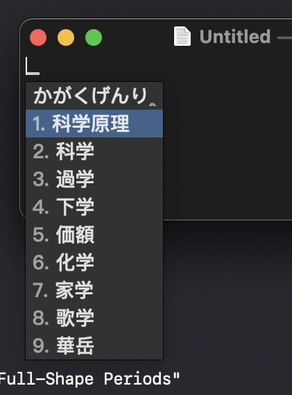
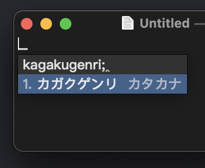
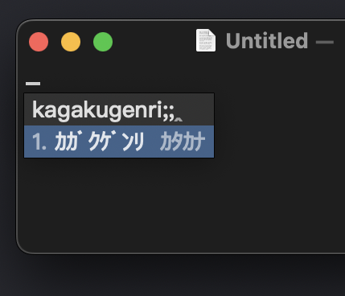
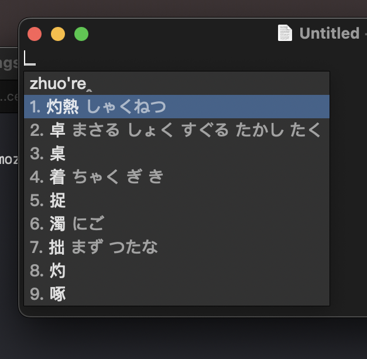

# HiFuMi: Rime で日本語入力 | 使用 Rime 輸入日語

[Rime](rime.im) 是一款全能中文輸入法，本方案則致力於通過 Rime 實現儘可能與 Mozc 可比的功能完整的日語輸入，從而展現可配置中文輸入引擎的強大能力。

# Installation

[Plum](https://github.com/rime/plum):
```
bash rime-install xrq-phys/rime-hifumi
# 重要: カタカナ変換のため以下のプロセスもおこなって下さい
RIME_LUA=~/Library/Squirrel/rime.lua # 鼠须管
cat >> $RIME_LUA<<EOF
katakana = require("katakana")
katakana_halfwidth = require("katakana_halfwidth")
EOF
```
- Add Hifumi to your `default.yaml`/`default.custom.yaml`.
- Deploy Rime.

### 無変換ひらがな入力

若要实现Return键平假名上屏，可以使用 [这里](https://github.com/xrq-phys/librime/releases/tag/R6Jun14) 提供的 dll/dylib 文件。
同时，该功能为已作为 commit_script_text 的默认行为整合入 librime。在 Weasel, Squirrel 和 iBus 的下一个版本中将不再需要这个操作。

### Weasel では 64-bit 版を使用してください

**请注意**: Mozc 词典非常庞大，会导致 deployment 的临时内存占用超出 32-bit 软件的 4GB 限制（实际占用约为 5GB 不到）。因此，请尽量在 64-bit 环境下使用 Rime-HiFuMi（[Weasel](https://github.com/rime/weasel/releases) 的最新版也已经支持 64-bit）。

# Usage







普通话查日语读音：



# Roadmaps

- [x] **PROGRAM MODIFICATION REQUIRED: [SEE HERE](https://github.com/xrq-phys/librime/releases/tag/R5Feb12)** Return composes Hiragana → Return composes composed + precomposed as Hiragana. After installation, add the following to your `hifumi.custom.yaml`:
```yaml
"editor/bindings/Return": commit_script_text_keep_selection
```
- [ ] ロマ字辞書加らかな辞書に移行ーロマ字入力はかなに変換から。それより辞書のサイズを減らすことが出来ます。目前使用的字典格式为 `kagaku → 科学` 格式，之后应将其切换为 `TT@H → 科学`。式中 `TT@H` 为假名**かがく**在 JIS 键盘上的对应位置，而 `kagaku → かがく` 的转换则由 `algebra` 完成。
- [ ] 辞書に変換確率を加え、日本語入力の効率向上を目指す。不仅使用 Mozc 辞典，导入 Mozc 的权重来提升输入效率。

# Roadmaps THAT DEPENDS ON UPSTREAM

- [ ] 预测输入／予測変換：该功能较为复杂，目前认为需等待上游添加中文预测后配置日文预测。当然亦有可能着手进行基于 Lua 的实现。


